# Classifieds Mobile App with Flutter and Firebase

This project is an e-commercial project where users can both sell and buy products that they log in as both sellers and buyers

## What can be done with this project?

All individuals must create an account before taking any action in the app.

With an account, an individual can act both as a seller and a buyer.

All individual as a seller can
-	post items for sale by entering product's description and image
-	edit their product's information.
-	bid on items that are on sale
-	favorite items on sale
-	see favorite items, bid on items
-	see offers for their items
-	share items on social media


## Notes

To run the project,

1. You should run the command below

```bash
flutter pub get
```

2. You should run the main.dart file


## Gallery

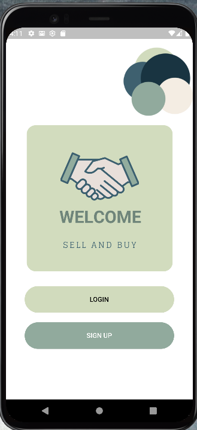

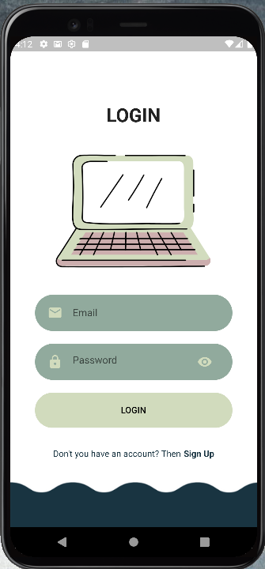


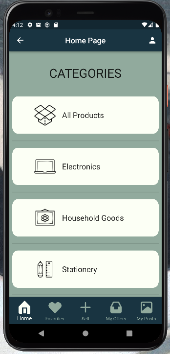


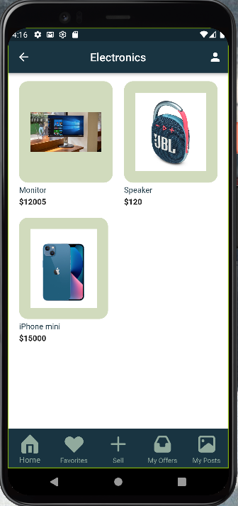

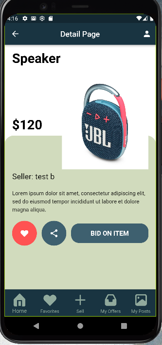

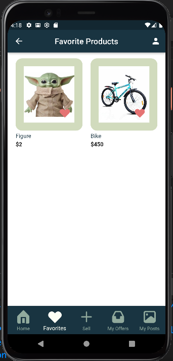

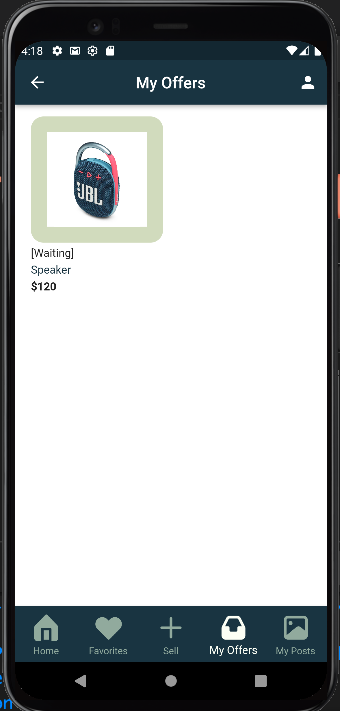

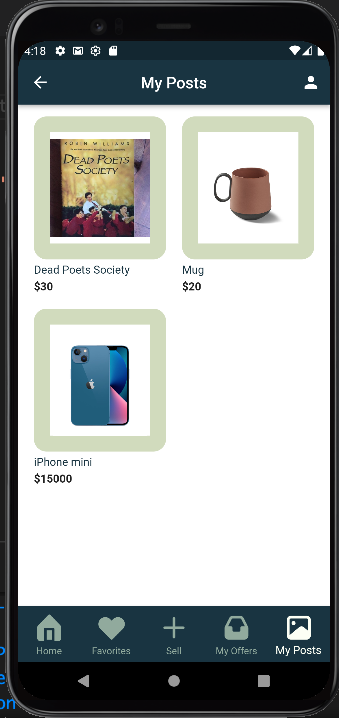

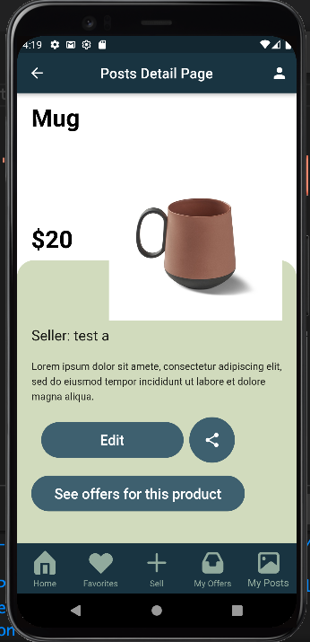

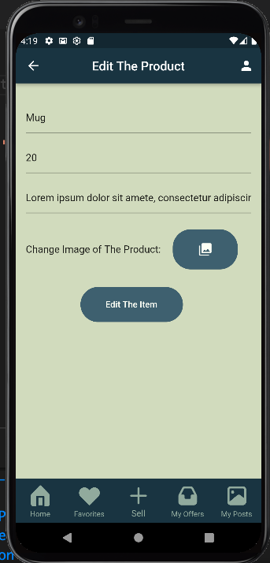

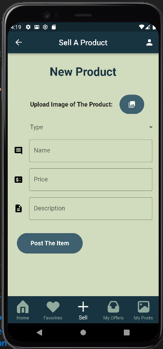


